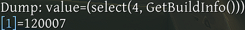
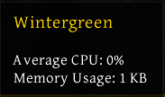
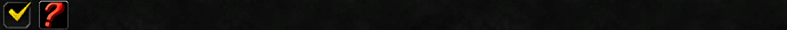
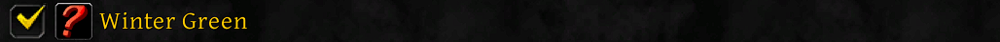
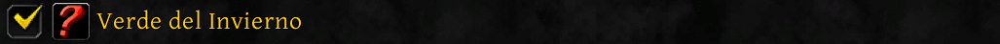
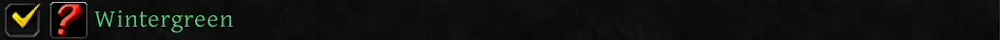

#  The Correct Path

For World of Warcraft to recognize an AddOn file, it must be in the proper place.  
If the AddOn's files are not in the correct path, the AddOn will be invisible to the game client.  

## Housing an AddOn

All AddOns recognized by World of Warcraft are found in `*\World of Warcraft\*\Interface\AddOns`.  
This series will create an AddOn for `Retail`, during the **Midnight** expansion.  

Navigate to `World of Warcraft\_retail_\Interface\AddOns`.  
Each installed Retail AddOn appears in its own folder, where this AddOn will also reside.

Before continuing, think about what to call the AddOn.  
Alternatively, continue and use the Author's AddOn name.

## Naming an AddOn

For this AddOn, create a folder in `*\World of Warcraft\_retail\Interface\AddOns`.  

An AddOn's folder can be named anything.  
Commonly, the AddOn folder has the same name as the AddOn it contains.   

Author named their AddOn `Wintergreen`.
Their AddOn Folder path is: `C:\Program Files (x86)\World of Warcraft\_retail_\Interface\AddOns\Wintergreen`.

An AddOn's folder by itself allows the game client to see the files within.  
At this point, the game client will see an empty folder.

# The Correct File

## Recognizing an AddOn

All World of Warcraft AddOns have a `.toc`, or `table of contents` file.  
This is required for the game client to recognize the files within the AddOn folder.  

While the game client can see whichever files are in the folder without a `.toc`, it doesn't know what to do with them.  
Think of it as a language in an unknown alphabet. It can be seen, though not understood.  

A properly formatted `.toc` file allows the AddOn to be displayed in the AddOns screen, accessed from the Game Menu.  
It is common to see the AddOn folder named in PascalCase, where each word has its first letter capitalized.  

Regardless of the capitalization of either the AddOn folder **or** the `.toc`, they must be the same characters in the same positions.  
The `.toc` **must** have the same name as the AddOn folder it is in.  

See below for a non-exhaustive list of examples involving two AddOn Folder names.
|Name of AddOn Folder|Acceptable `.toc` Name (1)|Acceptable `.toc` Name (2)|Acceptable `.toc` Name (3)|Unacceptable `.toc` Name|
|-|-|-|-|-|
|**Wintergreen**|`wintergreen.toc`|`WINTERGREEN.toc`|`wInTeRgreeN.toc`|`Winter green.toc`|
|**wInTeRgreeN**|`wintergreen.toc`|`WINTERGREEN.toc`|`Wintergreen.toc`|`Winter green.toc`|

<br>

|Name of AddOn Folder|Acceptable `.toc` Name (1)|Acceptable `.toc` Name (2)|Acceptable `.toc` Name (3)|Unacceptable `.toc` Name|
|-|-|-|-|-|
|**Winter green**|`winter green.toc`|`WINTER GREEN.toc`|`wInTeR greeN.toc`|`Wintergreen.toc`|
|**wInTeR greeN**|`winter green.toc`|`WINTER GREEN.toc`|`Winter green.toc`|`Wintergreen.toc`|

## Displaying an AddOn

For this AddOn, create a properly named `.toc` within the AddOn's folder.  
Author's AddOn `.toc` path is: `"C:\Program Files (x86)\World of Warcraft\_retail_\Interface\AddOns\Wintergreen\Wintergreen.toc"`.

With an empty `.toc` file, the AddOn will appear in the AddOn list, accessed from the Game Menu.  
See below for Author's AddOn in their AddOn list, accessed from the Game Menu.


If the AddOn folder was named `Wintergreen` and the `.toc` file was named `WINTERgreen.toc`, it would meet the proper formatting requirements.  
Despite this, the AddOn in the AddOn list, accessed from the Game Menu, would read `Wintergreen`.  

The AddOn folder is what the game client reads when the`.toc` file is empty while named appropriately.  

If the AddOn folder and `.toc` were named `WINterGrEEn` and `wintergreen.toc`, respectively, the AddOn list, accessed from the Game Menu, would read `WINterGrEEN`.
At this point, Author's AddOn will now return `true` to the Blizzard API `C_AddOns.DoesAddOnExist("Wintergreen")`

The AddOn's folder name can be queried in-game with the Blizzard API of `C_AddOns.GetAddOnName()`.

## Detailing an AddOn

The `.toc` file accepts several types of code formatting allowing up to `1,023` character per-line, the rest ignored by the game client.
Whitespace, also known as spaces or new lines are skipped by the game client and therefore are acceptable to use if desired for distinct separations.

**Comments**, signified by `# ` at the start of a line in a `.toc` file, are ignored by the game client, only seen when looking directly at the code.  

**Tags** , signified by `## ` at the start of a line in a `.toc` file, provide the metadata (information about other data) for the AddOn.  

This guide will use whitespace to separate the tag from its `##` and its associated value from `:`, though neither use of whitespace is required for functionality.  
If whitespace is the only character of a tag's value, or appears after the first non-whitespace character of a tag balue, they will be displayed as such.  

**Files**, signified by no extra symbol or space(s) at the start of a line in a `.toc` file, list each file that the game client is directed to read.   

Place each individual file on its own line as the game client only recognizes the first file on each line.  
The game client recognizes `.lua` and `.xml` files. Any unrecognized file name will be ignored by the game client.

# The Correct List

The game client is very direct about the files listed within the `.toc`.  
Only files within the list and only in the exact order they are entered, will be recognized by the Game Client.  

There can be multiple `.toc`s if desired, as long as they are suffixed with an underscore and the respective`game` type.  
As a piece of note, do not remove a `.toc` suffix in-game as the AddOn will no longer be loadable without that suffix until a full "Exit Game" has been performed, not a `/reload` or log-out.

`classic` is for all classic expansions, including TBC, WotLK, etc.  
`vanilla` is for World of Warcraft: Classic
`tbc` is for TBC Classic (including the Anniversary edition).  
`wrath` is for WotLK Classic (and Titan Reforged for Chinese players).  
`cata` is for Cataclysm Classic.  
`mists` is for Mists of Pandaria Classic.  
`mainline` is for the current retail expansion and all associated modes that could be enabled by Blizzard (such as Plunderstorm).    
`standard` is for the current retail expansion without Plunderstorm.  
`plunderstorm` is specifically for Plunderstorm.  
`wowhack` is for an unknown game-mode.

If an AddOn's folder was named `Wintergreen` and had a `.toc` for for all Classic expansions, plus another one specifically for Mists of Pandaria Classic, that AddOn would have two `.tocs`, a `Wintergreen_Classic.toc` and a `Wintergreen_Mists.toc`.  

## `Variables`

Limits set by the game client can be assigned to each file, per-line, with three variables.  
As long as the files follow a similar pathing, the variable can be used instead of each individual file listed. 

**`[TextLocale]`** is the text-locale for the current client.  
This nomenclature is based on set 1 of ISO-639 language codes and Alpha 2 of ISO-3166-1 country codes.  

`deDE.lua` is for German.
`enUS.lua` is for English.
`esES.lua` is for Spanish (Spain).
`esMX.lua` is for Spanish (Mexican).
`frFR.lua` is for French.
`itIT.lua` is for Italian.
`koKR.lua` is for Korean.
`ptBR.lua` is for Brazilian Portuguese.
`ruRU.lua` is for Russian.
`zhCN.lua` is for Chinese (Simplified)
`zhTW.lua` is for Chinese (Traditional)  

**`[Game]`** is the current type of the game-client.  

`classic` is for all classic expansions, including TBC, WotLK, etc.  
`vanilla` is for World of Warcraft: Classic
`tbc` is for TBC Classic (including the Anniversary edition).  
`wrath` is for WotLK Classic (and Titan Reforged for Chinese players).  
`cata` is for Cataclysm Classic.  
`mists` is for Mists of Pandaria Classic.   
`mainline` is for the current retail expansion and all associated modes that could be enabled by Blizzard (such as Plunderstorm).    
`standard` is for the current retail expansion without Plunderstorm.  
`plunderstorm` is specifically for Plunderstorm.  
`wowhack` is for an unknown game-mode.

**`[Family]`** is the section of game types available.  
 
 `Classic` is for all classic servers.

<ins>Classic Family</ins>:
`classic` is for all classic expansions, including TBC, WotLK, etc.  
`vanilla` is for World of Warcraft: Classic
`tbc` is for TBC Classic (including the Anniversary edition).  
`wrath` is for WotLK Classic (and Titan Reforged for Chinese players).  
`cata` is for Cataclysm Classic.  
`mists` is for Mists of Pandaria Classic.    

`Mainline` is for retail servers.  

<ins>Mainline Family</ins>: 
`mainline` is for the current retail expansion and all associated modes that could be enabled by Blizzard (such as Plunderstorm).    
`standard` is for the current retail expansion without Plunderstorm.  
`plunderstorm` is specifically for Plunderstorm.  
`wowhack` is for an unknown game-mode.  

When many files are named identically under different text-locales, games, and families, the `.toc` may become bloated.  
For example, presume an AddOn named `Wintergreen` had file paths as seen below.

`Wintergreen\CentralDatabase.lua`

`Wintergreen\Classic\` ...
- `ClassicHandler.lua`
- `SlashCommands.lua`
- `vanilla\` ...
  - `VanillaHandler.lua`
  - `enUS.lua`
  - `frFR.lua`
  - `Changelog.md`
- `cata\` ...
  - `CataclysmHandler.lua`
  - `enUS.lua`
  - `frFR.lua`
  - `Changelog.md`
- `mists\` ...
  - `MistsOfPandariaHandler.lua`
  - `enUS.lua`
  - `frFR.lua`
  - `Changelog.md`

`Wintergreen\Mainline\`...
- `MainlineHandler.lua`
- `SlashCommands.lua`
- `standard\` ...
  - `Changelog.md`
  - `enUS.lua`
  - `frFR.lua`
 `plunderstorm\`...
   - `PlunderstormHandler.lua`
  - `enUS.lua`
  - `frFR.lua`
  - `Changelog.md`

For every file from the above example recognizable by the game client, each can be listed in a `.toc`.    
Listing every file one-by-one is an appropriate, though lengthy, way to format files in a `.toc`, as seen below.

```
CentralDatabase.lua
Classic\ClassicHandler.lua
Classic\SlashCommands.lua
Classic\vanilla\VanillaHandler.lua
Classic\vanilla\enUS.lua
Classic\vanilla\frFR.lua
Classic\cata\CataclysmHandler.lua
Classic\cata\enUS.lua
Classic\cata\frFR.lua
Classic\mists\MistsOfPandariaHandler.lua
Classic\mists\enUS.lua
Classic\mists\frFR.lua
Mainline\MainlineHandler.lua
Mainline\SlashCommands.lua
Mainline\standard\enUS.lua
Mainline\standard\frFR.lua
Mainline\plunderstorm\PlunderstormHandler.lua
Mainline\plunderstorm\enUS.lua
Mainline\plunderstorm\frFR.lua
```

Blank lines and comments are skipped by the game client and can be used to mark distinct sections for human viewers.  
Below is an example of a `.toc` layout an Author might use during the retail expansion **Midnight**.

```
## Core
CentralDatabase.lua


## Classic (All)
Classic\ClassicHandler.lua
Classic\SlashCommands.lua

## Vanilla
Classic\vanilla\VanillaHandler.lua
Classic\vanilla\enUS.lua
Classic\vanilla\frFR.lua

## Cataclysm
Classic\cata\CataclysmHandler.lua
Classic\cata\enUS.lua
Classic\cata\frFR.lua

## Mists
Classic\mists\MistsOfPandariaHandler.lua
Classic\mists\enUS.lua
Classic\mists\frFR.lua


## Mainline
Mainline\MainlineHandler.lua
Mainline\SlashCommands.lua

## Midnight
Mainline\standard\enUS.lua
Mainline\standard\frFR.lua

## Plunderstorm
Mainline\plunderstorm\PlunderstormHandler.lua
Mainline\plunderstorm\enUS.lua
Mainline\plunderstorm\frFR.lua
```

As an alternative to comments and blank lines, variables can greatly condense the amount of entries for appropriately named folder paths as seen below.

```
CentralDatabase.lua
[Family]\ClassicHandler.lua
[Family]\MainlineHandler.lua
[Family]\[Game]\VanillaHandler.lua
[Family]\[Game]\CataclysmHandler.lua
[Family]\[Game]\MistsOfPandariaHandler.lua
[Family]\[Game]\PlunderstormHandler.lua
[Family]\SlashCommands.lua
[Family]\[Game]\[TextLocale].lua
```

## `Directives`

Limits set by the AddOn author can be assigned to each file, per-line, with three conditional directives.  
These can be placed anywhere on the file line. If placed at the end, they are much less likely to interfere with variables.

`[AllowLoad ...]` only loads in-game, or the glue screen environment, also known as the Character Select screen.
Only Blizzard is able to modify code in the glue screen environment, which makes this directive inoperable.  

`[AllowLoadGameType ...]` only loads in the specific `[Game]` client type.  
`[ExcludeLoadGameType ...]` specifically prohibits loading in the specific `[Game]` client type.  

`classic` is for all classic expansions, including TBC, WotLK, etc.  
`vanilla` is for World of Warcraft: Classic
`tbc` is for TBC Classic (including the Anniversary edition).  
`wrath` is for WotLK Classic (and Titan Reforged for Chinese players).  
`cata` is for Cataclysm Classic.  
`mists` is for Mists of Pandaria Classic.  
`mainline` is for the current retail expansion and all associated modes that could be enabled by Blizzard (such as Plunderstorm).    
`standard` is for the current retail expansion without Plunderstorm.  
`plunderstorm` is specifically for Plunderstorm.  
`wowhack` is for an unknown game-mode.

`[AllowLoadTextLocale ...]` only loads in the specific text-locale.  
Locales can be found through `GetLocale()`, otherwise listed in the Blizzard game files.  

Locale nomenclature is based on set 1 of ISO-639 language codes and Alpha 2 of ISO-3166-1 country codes.  

`deDE.lua` is for German.
`enUS.lua` is for English.
`esES.lua` is for Spanish (Spain).
`esMX.lua` is for Spanish (Mexican).
`frFR.lua` is for French.
`itIT.lua` is for Italian.
`koKR.lua` is for Korean.
`ptBR.lua` is for Brazilian Portuguese.
`ruRU.lua` is for Russian.
`zhCN.lua` is for Chinese (Simplified)
`zhTW.lua` is for Chinese (Traditional)  

`[Bootstrap]` loads on log-in before the AddOn is loaded itself, specifically for AddOns that `Load On Demand`, `Load With`, or have their loading status managed by another AddOn as a `Load Manager`.

The directives only usable by Blizzard are as seen below.  

|Exclusive Directives|
|-|
|AllowLoadEnvironment|
|LoadIntoEnvironment|

# The Correct Tags

A complete list of **usable tags**, as some are Blizzard-only, is seen below.  
Each will each be covered in their own section.  

The `Interface` tag is the only **required** tag.

|Tag|
|-|
|Interface|
|Title|
|IconAtlas|
|IconTexture|
|Notes|
|Author|
|Version|
|Category|
|Group|
|Dependencies|
|RequiredDeps|
|OptionalDeps|
|LoadManagers|
|OnlyBetaAndPTR|
|AllowLoadGameType|
|LoadOnDemand|
|LoadWith|
|DefaultState|
|AddOnCompartmentFunc|
|AddOnCompartmentFuncOnEnter|
|AddOnCompartmentFuncOnLeave|
|SavedVariables|
|SavedVariablesPerCharacter|
|LoadSavedVariablesFirst|
|AllowAddOnTableAccess|
|X-*|

The tags only usable by Blizzard are as seen below.  

|Exclusive Tags|
|-|
|AllowLoad|
|LoadFirst|
|EscalateErrorDuringLoad|
|UseSecureEnvironment|
|SavedVariablesMachine|

The `.toc` tags of an AddOn that can be queried with the Blizzard API of  
`C_AddOns.GetAddOnMetadata()`  are as shown below.  

|Metadata Tags|
|-|
|Title|
|IconAtlas|
|IconTexture|
|Notes|
|Author|
|Version|
|Category|
|Group|
|AddOnCompartmentFunc|
|AddOnCompartmentFuncOnEnter|
|AddOnCompartmentFuncOnLeave|
|`X-*`|

## `Interface` | `## Interface: `

To allow the game client to parse the `.toc` file and remove the red color from the AddOn in the AddOn list, accessed from the Game Menu, the `Interface` tag must be defined.  
The `Interface` tag is required for the above reasons and takes a series of **6** or **5** numbers, depending on the type of game client (`Retail`, `Classic`, etc.).  

`Retail`, during the **Midnight** expansion, was introduced in `12.0.0`.  
The first one or two numbers of the `interface` **tag** correspond to the expansion.  

`12....` is the beginning of the retail interface number of the Midnight expansion.  

The next two numbers of the `Interface` **Tag** correspond to the major patch.  
As of time of writing, **Midnight** is on Patch `12.0.7`.  

`..00..` is the middle of the retail interface number during the Midnight expansion, patch `12.0.7`.  

The last two numbers of the `Interface` **Tag** correspond to the minor patch.  

`....07` is the end of the retail interface number during the Midnight expansion, patch `12.0.7`.

The interface number of the retail game client at time of writing is `120007`.  
To access the interface number of the game client currently logged into, type or paste into the chat bar the following code and hit enter:  
`/dump (select(4, GetBuildInfo()))`  

See below for Author's chatbox output after using entering `/dump (select(4, GetBuildInfo()))` in their chatbox, at time of writing.



Multiple interface tags may be used as long as they are all separated by commas.  
To support Retail Midnight Patch 12.0.7 and Vanilla WoW, the `Interface` **Tag** would be `120007, 11508`.  

Author's AddOn will be for Retail, Midnight Patch 12.0.7. Their addition to their `.toc` file is as seen below.

```
## Interface: 120007
```

Their AddOn, in the AddOn list accessed from the game menu, is no longer red as the game does not believe it to be out of date.  
See below for Author's AddOn, in the AddOn list accessed from the Game Menu.


When an AddOn in the AddOn list, as accessed from the game menu is recognized and is not marked out of date, it then has its own tooltip!  
See below for Author's AddOn tooltip when hovering over their AddOn in the AddOn list, as accessed from the game menu.



An AddOn's interface version can be queried with the Blizzard API of  `C_AddOns.GetAddOnInterfaceVersion()`.

## `Title` | `## Title: `

The `Title` and `Version` tags share the same visible line in an AddOn's tooltip in the AddOn list, as accessed from the game menu.  

An AddOn's `## Title: ` tag can be queried with the Blizzard APIs of `C_AddOns.GetAddOnMetadata()`,  `C_AddOns.GetAddOnTitle()`, and `C_AddOns.GetAddOnInfo()`.  
Titles in different text-locales are only queried through "Title", as the client parses out any text-locale (`-enUS`, `-esES`) and only shows its currently active one.

Without a `Title` tag, the AddOn's name will match the name of the folder present in `World of Warcraft\*\Interface\AddOns`, with `*` corresponding to the game version that the AddOn is made for.  

If a `Title` tag is included, then any character that follows the tag will be recognized as the AddOn's name in the AddOn list, as accessed from the game menu, up to the maximum character limit per `.toc` line of `1,023` characters.  

More importantly, the AddOn's placement in the AddOn list, as accessed from the game menu, is based on it's alphabetical placement in the AddOn folder list.  
If an AddOn folder/`.toc` was named `Seraphine` while `Seraphine.toc`'s `## Title: ` was `Wintergreen`, `Wintergreen` would appear in the `S`'s of the AddOn list, as accessed from the game menu.  

If a `Title` tag has no characters after it, then no name will be displayed.  
See below for the `.toc` addition required for an AddOn in the AddOn List, as accessed from the game menu, to appear blank.



If the AddOn folder was named `Wintergreen` and the `.toc` file was named `Wintergreen.toc`, yet in-game the Author would like it to be called `Winter Green`, they can do so with the `Title` tag.  
That case would require the following `Title` tag to be added in their `.toc` file.

```
## Title: Winter Green
```



An Author's AddOn may refer to a non-branded item, such as `Raid Calendar`, and decide to translate their AddOn's name into different languages.  
If the AddOn was named `Winter Green`, it would be translated as `Verde del Invierno` in Spanish.  

Title tags can be localized!    
By default, a plain `Title` tag will show the same name across all text-locales.  

Author's text-locale is `enUS`, so the following `Title` tags achieve the same result:  `## Title: Winter Green`, `## Title-enUS: Winter Green`  

if the AddOn was to be named `Winter Green` in `enUS` (English) and `Verde del Invierno` in `esES` (Spanish (Spain)) in the AddOn list, accessed from the Game Menu, the following `.toc` additions would be needed.

```
## Title-enUS: Winter Green
## Title-esES: Verde del Invierno
```

The game client, when in a text-locale of `esES` (Spanish (Spain)), will show the `esES` `Title` in the AddOn List, accessed from the Game Menu.  



If the `Title` tags all specify their text-locale and the game client does not match any of the text-locale-specific `Title` tags, the name of the AddOn in the AddOn list, accessed from the Game Menu, will default to the name of the AddOn Folder, as if no `Title` tag was added at all.  

If there is a `Title` tag without a text-locale appended and a `Title` tag with a text-locale appended, the `Title` tag without a text-locale appended will be the `Title` for every text-locale that is not the one listed in the `Title` tag with a text-locale appended.  

`Tags` are not spared from the chronological "top to bottom" approach that `.toc` files follow.  
If there is a `Title` tag without a text-locale specified that comes after a `Title` tag with a text-locale specified, the `Title` tag without a text-locale specified will be the AddOn's name in the AddOn list, accessed from the Game Menu.  

The last changes that a `Title` tag can handle are that of rendering colors.  
A significant reason that an individual may not wish to specify a color for their title is that it will no longer turn red when an error is detected.  

An example of an AddOn turning red when there is a critical error is when there was no interface tag, therefore being deemed incompatible.  


For colored titles, the color is preserved regardless of errors.  
Errors in loading, as seen in the AddOns List accessed from the AddOns button from the Game Menu will always have a few words as to the reason on the right-hand side, such as "Incompatible" shown above.

Strings can be rendered in color through the use of UI escape sequences.  
The beginning of the sequence is designated by `|c`, for `color`, and ended with `|r`, for `render`.

The next eight characters match to an 8-digit hex code.  
The `Alpha` (Opacity), `Red`, `Green`, and `Blue` each have two characters, respectively in the 8-digit hex code.  

WoW requires an alpha code but does not accept changes in this color rendering format.  
The alpha, in this case, will always default to `ff`. For consistency, place `ff` after the `|c`.  

The remaining six characters come directly from the traditional 6-digit hex code.  
Emerald Green has a traditional 6-digit hex code of `50C878`.  

Hex Codes do not change based on capitalization of the letters, so if it is easier to view them in capitals then that is perfectly fine.  
For example, `#50C878` is the same exact Hex Code as `#50c878`.

The color rendering code for Emerald Green in WoW would be `|c` `ff` `50` `C8` `78` `|r`.  
The text to be colored would come after the eight character of the 8-digit hex code, right before the `|r`.

If an AddOn had a `Title` tag of  `## Title: Wintergreen`, and the Author wanted the AddOn's title in the AddOn list, accessed from the Game Menu to be displayed in `Emerald Green`, the `.toc` addition required would be as shown below.

```
## Title: |cff50C878Wintergreen|r
```



For multiple colors to be rendered, each string in a different color requires their own color rendering code.  
The main caveat comes when color codes have no breaks to allow default formatting in between the beginning and the end.  

If an AddOn had a `Title` tag of  `##Title: Winter Green`, and the Author wanted the `Winter` and `Green` in the AddOn's title in the AddOn list, accessed from the Game Menu, to be shown as `White` (`ffffff`) and `Emerald Green` (`50C878`), respectively, the `.toc` addition required would be as shown below. 

```
## Title: |cffffffffWinter |cff50C878Green|r
```


Only one `|r` was used, despite two `|c`s. This is allowed because the `|c` signifies that the follow string must be colored.  
If another color interjects the middle of the color, a `|r` is the same "stop" for both of them.

If a gradient was desired, each individual character would require their own opening color rendering code.  
Author endorses [ColorDesigner: Gradient Generator](https://colordesigner.io/gradient-generator), due to its ease of use with customizable stops to align with how many characters are used.  

Author wishes their AddOn's name of `Wintergreen` in the AddOn list, accessed from the game menu, to show as a gradient of white (`ffffff`) to Medium Spring Green (`00ff9d`).  
There are `11` characters in the word `Wintergreen`. See below for the use of [ColorDesigner: Gradient Generator](https://colordesigner.io/gradient-generator) to accomplish a gradient of white (`ffffff`) to Medium Spring Green (`00ff9d`)

![A large white header of "Gradient Generator" lies at the top of the page. To the left of the image are two tabs, one in orange titled "2 colors", the other in white title "3+ colors". A large color block is below the tabs, a white. Underneath that is a dark blue background that resembles the page's background of dark blue and grey gridlines. Two arrows that circle each other reside in this space. Below the arrows is another color block, one of Medium Spring Green. The middle of the page is a series of colored boxes, each a different color that have a written-out HEX, RGB, and HSL code below them. At the top is a slider underneath the word "Steps", with an adjacent plus-or-minus box that is set to the number 11. There is a dropdown to the immediate right, underneath the word "Color Space", set to "sRGB".](01_TableOfContentsImage09.png)

If an `|r` was placed after every character, the functionality would be identical.  
Author decided to not include the excess `|r`s for visual simplicity as each letter is encased in a set of `| |`.

See below for Author's `.toc` addition to accomplish a gradient of white that starts at `W` and ends on Medium Spring Green at the second `n`, displayed in the AddOn list, accessed from the game menu.  

```
## Title: |cffffffffW|cffe6fff5i|cffccffebn|cffb3ffe2t|cff99ffd8e|cff80ffcer|cff66ffc4g|cff4dffbar|cff33ffb1e|cff19ffa7e|cff00ff9dn|r
```


## `Icon Atlas` | `##IconAtlas: `

Instead of a red question-mark on a black background, an AddOn can have any Icon that an Author desires it to have in the AddOn list, accessed from the game menu.  
In-game graphics are available for the AddOn's icon in the AddOn list, accessible from the Game Menu, though they will not appear in their respective tooltip.  

If an AddOn's Author wants their AddOn in the AddOn list, as accessed from the Game Menu to have no icon, either an `IconAtlas` or `IconTexture` tag would need to be empty.  
One of the two `.toc` additions required for an AddOn in the AddOn list, as accessed from the Game Menu to have no icon is as seen below.   

Either:

```
## IconAtlas: 
```

or

```
## IconTexture:
```


Icons can be found through their `Texture` or their `Atlas` ID.  
An `IconAtlas` is a collection of Icons into one file, where each can be referenced individually.  

An IconAtlas can be viewed in-game through the AddOn [Texture Atlas Viewer](https://www.curseforge.com/wow/addons/textureatlasviewer) by `LanceDH`.  
The AddOn's data is based off of`ctxfox`'s [automatically-generated website](https://www.townlong-yak.com/framexml/live/Helix/AtlasInfo.lua).  

See below for Author's `Texture Atlas Viewer` in-game, at time of writing.  

![A grey panel has a header of "Texture Atlas Viewer" in yellow. On the left is a list of buttons with names of World of Warcraft's Icon Atlases in yellow. The remainder of the screen is a grey window with necrolord graphics in certain highlightable segments. Behind the grey window of necrolord graphics is a black marbled background. The bottom left corner of the grey window displaying the necrolord assets and black marbeled background contains a cluster of coordinates for the mouse cursor position, along with a scaling slider (currently set at 40%), a LFG eye marker, a back arrow, and a color picker for the black marbled background. There is a text box below the cluster settings with an entry of "n/ covenantrenownnecrolord".  ](01_TableOfContentsImage13.png)

Within the `covenantrenownnecrolord`icon atlas, a green orb is the second to last clickable segment on the top row.  
Its name is within the text box below the cluster of settings in the bottom left of the texture viewer window within the texture atlas viewer panel.

The green orb in the `covenantrenownnecrolord` icon atlas is called `CovenantSanctum-Renown-Next-Glow-Necrolord`.  
To use this icon for the AddOn's icon in the AddOn list, accessible from the game menu, the following `.toc` addition is required. 

```
## IconAtlas: CovenantSanctum-Renown-Next-Glow-Necrolord
```


`IconAtlas` tags can be localized!  
An AddOn's `## IconAtlas: ` tag can be queried with the Blizzard API of `C_AddOns.GetAddOnMetadata()`.

## `Icon Texture` | `## IconTexture: `

Instead of a red question-mark on a black background, an AddOn can have any Icon that an Author desires it to have in the AddOn list, accessed from the game menu.  
In-game graphics are available for the AddOn's icon in the AddOn list, accessible from the Game Menu, though they will not appear in their respective tooltip.  

If an AddOn's Author wants their AddOn in the AddOn list, as accessed from the Game Menu to have no icon, either a `IconTexture` or `IconAtlas` tag would need to be empty.  
One of the two `.toc` additions required for an AddOn in the AddOn list, as accessed from the Game Menu to have no icon is as seen below.   

Either:

```
## IconTexture: 
```

or

```
## IconAtlas:
```


Icons can be found through their `Texture` or their `Atlas` ID.  
An `IconTexture` can be referenced through an Icon Name or Icon ID.    

Author endorses use of [WoWhead's Icon Database](https://www.wowhead.com/icons).  
Author's icon on WoWhead has an Icon Name of  `spell_nature_wispsplodegreen` and an Icon ID of `237556`.  


For an Icon Name, a file path is required that begins with `Interface\Icons\`.  
The `spell_nature_wispsplodegreen` icon would become `Interface\Icons\spell_nature_wispsplodegreen`

The Icon ID, if supplied in the `IconTexture` tag, is all that is needed.  
For the AddOn in the AddOn list, accessed from the game menu to display an Icon with a name of `spell_nature_wispsplodegreen` and an ID of `237556`, one of the following `.toc` additions is required.

Either:

```
## IconTexture: 237556
```

or

```
## IconTexture: Interface\Icons\spell_nature_wispsplodegreen
```


Using an `IconTexture` tag will nullify an `IconAtlas` tag, even if `IconAtlas` is listed after the `IconTexture` tag in the `.toc`.

Author intends to use a custom icon.  
Author used the Harrington Font and free software to create their logo. 


WoW does not accept `.png` or `.jpg` files, requiring a `.tga` file for this instance.
To convert a `.png` file to a `.tga` file, author at time of writing used [Online Convert](https://www.online-convert.com/).  

Author's file of `WintergreenIcon.tga` inside their `Wintergreen` Retail AddOn folder, has a path as seen below.  
`C:\Program Files (x86)\World of Warcraft\_retail_\Interface\AddOns\Wintergreen\WintergreenIcon.tga`

The file extension may be listed, but does not need to be as long as that is the only file with that name.  
Author's `.toc` addition for their AddOn in the AddOn list, as accessed from the game menu, of their custom icon is as shown below.

```
## IconTexture: Interface\AddOns\Wintergreen\WintergreenIcon
```


`IconTexture` tags can be localized!  
An AddOn's `## IconTexture: ` tag can be queried with the Blizzard API of `C_AddOns.GetAddOnMetadata()`.

## `Notes` | `## Notes: `

The notes section appears in white, on the tooltip shown when hovering over an AddOn in the AddOn list, accessed from the game menu.  
Any information can be placed here, with the only limit of characters being the maximum allowed on a `.toc` line, `1,023` characters.  

An AddOn's notes can be queried with the Blizzard APIs of  
`C_AddOns.GetAddOnNotes() and `C_AddOns.GetAddOnInfo()`.   

The tooltips of AddOns in the AddOn list, as accessed from the game menu primarily expand vertically.  
To demonstrate the character limit of `1,023` characters, the following passage is `1,026` characters.

```
This is an attempt to reach 1,026 characters. While the character limit is 1,023, having extra characters will prove where the true cutoff lies. Considering that this portion is exactly 226 characters, it will need to repeat. This is an attempt to reach 1,026 characters. While the character limit is 1,023, having extra characters will prove where the true cutoff lies. Considering that this portion is exactly 226 characters, it will need to repeat. This is an attempt to reach 1,026 characters. While the character limit is 1,023, having extra characters will prove where the true cutoff lies. Considering that this portion is exactly 226 characters, it will need to repeat. This is an attempt to reach 1,026 characters. While the character limit is 1,023, having extra characters will prove where the true cutoff lies. Considering that this portion is exactly 226 characters, it will need to repeat. Instead of a 5th repeat, this last portion proves that the 1,023rd character is the cutoff. It's cut right here!
```

Important consideration should be kept on the character limit in a `.toc` file is per line, not per tag contents.    
There are 10 characters required for the `Notes` tag.  

With a `1,026` character passage and `10` characters already taken by the `Notes` tag, the above `1,026` character passage should end with `It's cut right he`, excluding the rest of the sentence `re!`.  
See below for the `.toc` addition required to include the `1,026` character passage in the `Notes`.  

```
## Notes: This is an attempt to reach 1,026 characters. While the character limit is 1,023, having extra characters will prove where the true cutoff lies. Considering that this portion is exactly 226 characters, it will need to repeat. This is an attempt to reach 1,026 characters. While the character limit is 1,023, having extra characters will prove where the true cutoff lies. Considering that this portion is exactly 226 characters, it will need to repeat. This is an attempt to reach 1,026 characters. While the character limit is 1,023, having extra characters will prove where the true cutoff lies. Considering that this portion is exactly 226 characters, it will need to repeat. This is an attempt to reach 1,026 characters. While the character limit is 1,023, having extra characters will prove where the true cutoff lies. Considering that this portion is exactly 226 characters, it will need to repeat. Instead of a 5th repeat, this last portion proves that the 1,023rd character is the cutoff. It's cut right here!
```

![A black background with the word "Wintergreen" displayed in a gradient at the top. The gradient starts at "W" as white (Hex Code: #FFFFFF), and ends at the second "n" at the end of the word (Hex Code: #00ff9d). This is then followed by a line break and then the words "This is an attempt to reach 1,026 characters. While the character limit is 1,023, having extra characters will prove where the true cutoff lies. Considering that this portion is exactly 226 characters, it will need to repeat.", repeated four times and ending with "Instead of a 5th repeat, this last portion proves that the 1,023rd character is the cutoff. It's cut right he" in white. After the Notes section is an empty line with two other lines below, one titled "Average CPU:" with an output of "0%", the other titled "Memory Usage:", with an output of "1 KB".](01_TableOfContentsImage19.png)

As seen in the photo, the cutoff is indeed `1,023` characters, ending with `It's cut right he` and excluding the rest of the sentence `re!`.  
Spacing also impacts how the tooltip appears, as the game client will not automatically break up continuous text.  

To demonstrate this point, the below `100` character passage states that `.toc` whitespace is ignored by the game client whenever not indicative of a string's whitespaces.

```
.tocfiles'whitespaceisindeedignoredbythegameclientwheneverthatisnotindicativeofastring'swhitespaces.
```

The `.toc` addition required for the new `100` character passage without spaces is as seen below.

```
## Notes: .tocfiles'whitespaceisindeedignoredbythegameclientwheneverthatisnotindicativeofastring'swhitespaces.
```

![A black background with the word "Wintergreen" displayed in a gradient at the top. The gradient starts at "W" as white (Hex Code: #FFFFFF), and ends at the second "n" at the end of the word (Hex Code: #00ff9d). This is then followed by a line break and then the string ".tocfiles'whitespaceisindeedignoredbythe..." in white. After the Notes section are two empty lines with two other lines below, one titled "Average CPU:" with an output of "0%", the other titled "Memory Usage:", with an output of "1 KB".](01_TableOfContentsImage20.png)

The overflow in the above picture is noticed through it's ending with `ignoredbythe...`, ignoring the rest of the sentence `gameclientwheneverthatisnotindicativeofastring'swhitespaces`.  
Depending on how large the overflow is, the tooltip will expand in height without revealing any more information.  

When the above `100` character string is repeated nine times, only blank lines are added above and below.  
See below for the `.toc` addition required to show the above `100` character string repeated nine times.  

```
## Notes: .tocfiles'whitespaceisindeedignoredbythegameclientwheneverthatisnotindicativeofastring'swhitespaces..tocfiles'whitespaceisindeedignoredbythegameclientwheneverthatisnotindicativeofastring'swhitespaces..tocfiles'whitespaceisindeedignoredbythegameclientwheneverthatisnotindicativeofastring'swhitespaces..tocfiles'whitespaceisindeedignoredbythegameclientwheneverthatisnotindicativeofastring'swhitespaces..tocfiles'whitespaceisindeedignoredbythegameclientwheneverthatisnotindicativeofastring'swhitespaces..tocfiles'whitespaceisindeedignoredbythegameclientwheneverthatisnotindicativeofastring'swhitespaces..tocfiles'whitespaceisindeedignoredbythegameclientwheneverthatisnotindicativeofastring'swhitespaces..tocfiles'whitespaceisindeedignoredbythegameclientwheneverthatisnotindicativeofastring'swhitespaces..tocfiles'whitespaceisindeedignoredbythegameclientwheneverthatisnotindicativeofastring'swhitespaces..tocfiles'whitespaceisindeedignoredbythegameclientwheneverthatisnotindicativeofastring'swhitespaces.
```

![A black background with the word "Wintergreen" displayed in a gradient at the top. The gradient starts at "W" as white (Hex Code: #FFFFFF), and ends at the second "n" at the end of the word (Hex Code: #00ff9d). This is then followed by multiple line breaks and then the string ".tocfiles'whitespaceisindeedignoredbythe..." in white. After the Notes section are multiple line breaks with two other lines below, one titled "Average CPU:" with an output of "0%", the other titled "Memory Usage:", with an output of "1 KB".](01_TableOfContentsImage21.png)

Author's addition to their `.toc` file is much simpler, `My first AddOn, primarily a learning experience!`.  
See below for Author's addition to their `.toc` file.

```
## Notes: My first AddOn, primarily a learning experience!
```

![A black background with the word "Wintergreen" displayed in a gradient at the top. The gradient starts at "W" as white (Hex Code: #FFFFFF), and ends at the second "n" at the end of the word (Hex Code: #00ff9d). This is then followed by a line break and then the words "My first AddOn, primarily a learning experience!" in white. After the Notes section is an empty line with two other lines below, one titled "Average CPU:" with an output of "0%", the other titled "Memory Usage:", with an output of "1 KB".](01_TableOfContentsImage22.png)

`Notes` tags can be localized!  
An AddOn's `## Notes: ` tag can be queried with the Blizzard API of `C_AddOns.GetAddOnMetadata()`.  

## `Author` | `## Author: `

`Author` tags can be localized!  
An AddOn's `## Author: ` tag can be queried with the Blizzard APIs of `C_AddOns.GetAddOnMetadata()`.

Author's addition to their `.toc` file is as seen below.

```
## Author: Swift
```

## `Version` | `## Version: `

The `Version` and `Title` tags share the same visible line in an AddOn's tooltip in the AddOn list, as accessed from the game menu.  

`Version` tags can be localized!  
An AddOn's `## Version: ` tag can be queried with the Blizzard API of `C_AddOns.GetAddOnMetadata()`.

A software "version" isn't reflective of anything other than the state of a specific piece of software at its time of release.  
If there is an unintended function that is to be resolved later, that newer instance would be a different version.  

As such, anything that comes after the `## Version: ` tag in the `.toc` only serves the purpose that the AddOn author deems it to.  
Many different version styling methods exist, the most common being `Semantic Versioning` (or `SemVer`).  

`Semanting Versioning` is a well-known and utilized version naming system with the following structure: `MAJOR.MINOR.PATCH`.  
What is defined as `major`, `minor`, and a `patch` are all subjective.  

As `Semantic Versioning` defines it:
- `MAJOR` is for incompatible changes added.
- `MINOR` is for backward-compatible functionality added.
- `PATCH` is for backward-compatible bug fixes.

Some AddOn authors prefix their `Semantic Versioning` with a `v` for `version`.  
Any manner of styles can be used and do not affect the codebase at all.  

Author's AddOn is not yet released, and no code has been added to the codebase except for `.toc`.  
To represent a version of `0.0.0`, a `.toc` addition would be required as seen below.

```
## Version: 0.0.0
```

![A black background with the word "Wintergreen" displayed in a gradient at the top. The gradient starts at "W" as white (Hex Code: #FFFFFF), and ends at the second "n" at the end of the word (Hex Code: #00ff9d). To the right of that same line is "0.0.0" in yellow. The next line contains the words "My first AddOn, primarily a learning experience!" in white. After the Notes section is an empty line with two other lines in white below, one titled "Average CPU:" with an output of "0%", the other titled "Memory Usage:", with an output of "1 KB".](01_TableOfContentsImage23.png)

Author intends to color their version's `major`, `minor`, and `patch` sections.  
As what comes after the `## Version: ` tag is a string, it will accept any rendering code that strings in WoW do.  

Author's `major`, `minor`, and `patch` version numbers will be Medium Spring Green (Hex Code: `#00ff9d`), a slightly darker Medium Spring Green (Hex Code: `#00ffb7`), and Turquoise Blue (Hex Code: `#00ffe6`), respectively.  
Each of the `major`, `minor`, and `patch` version numbers' `.` separators will be in white (Hex Code: `#ffffff`).

To clearly demonstrate the color differences, Author will use `MAJOR`, `MINOR`, and `PATCH` instead of `0`s for all three sections.  
See below for the `.toc` addition required to show a `Version` of `MAJOR` in `#00ff9d`, `MINOR` in `#00ff36`, `PATCH` in `#00ff36`, and `.` separators in `#ffffff`.

```
## Version: |cff00ff9dMAJOR|cffffffff.|cff00ffb7MINOR|cffffffff.|cff00ffe6PATCH|r
```

![A black background with the word "Wintergreen" displayed in a gradient at the top. The gradient starts at "W" as white (Hex Code: #FFFFFF), and ends at the second "n" at the end of the word (Hex Code: #00ff9d). To the right of that same line is "MAJOR.MINOR.PATCH", with "MAJOR" in Medium Spring Green (Hex Code: #00ff9d), "MINOR" in a slightly darker Medium Spring Green (Hex Code: #00ff36), "PATCH" in Turquoise Blue (Hex Code: #00ff36), and each of the two"." separators in white (Hex Code: #ffffff). The next line contains the words "My first AddOn, primarily a learning experience!" in white. After the Notes section is an empty line with two other lines in white below, one titled "Average CPU:" with an output of "0%", the other titled "Memory Usage:", with an output of "1 KB".](01_TableOfContentsImage24.png)

Author's addition to their `.toc` file is the same as above, replacing the `MAJOR`, `MINOR`, and `PATCH` strings with `0`s.  
See below for Author's `.toc` addition.  

```
## Version: |cff00ff9d0|cffffffff.|cff00ffb70|cffffffff.|cff00ffe60|r
```
![A black background with the word "Wintergreen" displayed in a gradient at the top. The gradient starts at "W" as white (Hex Code: #FFFFFF), and ends at the second "n" at the end of the word (Hex Code: #00ff9d). To the right of that same line is "0.0.0", with the first "0" in Medium Spring Green (Hex Code: #00ff9d), the second "0" in a slightly darker Medium Spring Green (Hex Code: #00ffb7), the third "0" in Turquoise Blue (Hex Code: #00ffe6), and each of the two "." separators in white (Hex Code: #ffffff). The next line contains the words "My first AddOn, primarily a learning experience!" in white. After the Notes section is an empty line with two other lines in white below, one titled "Average CPU:" with an output of "0%", the other titled "Memory Usage:", with an output of "1 KB".](01_TableOfContentsImage25.png)

## `Category` | `## Category: `

AddOn categories, just like the `Version` are simply strings that people generally presume the same meaning from.  
However, there are a certain set that are generally agreed upon and it is recommended to stick to them for easier collection of similar AddOns.  

|Category|
|-|
|Action Bars|
|Auctions|
|Buffs & Debuffs|
|Chat|
|Collections|
|Combat|
|Data Broker|
|Development Tools|
|Dungeons & Raids|
|Equipment|
|Expansion Features|
|Housing|
|Inventory|
|Libraries|
|Loot|
|Map|
|Media|
|Minigames|
|Other|
|Pet Battles|
|Professions|
|PvP|
|Quests|
|Roleplay|
|UI Overhaul|
|Unit Frames|
|User Interface|

The first-alphabetically matched `Category` can be seen in the AddOn list, as accessed from the Game Menu.  

`Category` tags can be localized!  
An AddOn's `## Category: ` tag(s) can also be queried with the Blizzard API of `C_AddOns.GetAddOnMetadata()`.  

Categories in different text-locales are only queried through "Title", as the client parses out any text-locale (`-enUS`, `-esES`) and only shows its currently active one.

Author's AddOn at time of writing will not have a category, therefore no `Category` `.toc` addition will be made.

## `Dependencies` | `## Dependencies: `  

AddOns may require sibling or parent AddOns to function.  
To ensure the appropriate AddOns are loaded together, a warning can appear next to the AddOn in the AddOn list based on different states.  

Author's AddOn list, accessed in the AddOns list from the Game Menu has surrounding AddOns of [What Did I Cast](https://www.curseforge.com/wow/addons/what-did-i-cast), [World Quest Tab](https://www.curseforge.com/wow/addons/worldquesttab), and [WoW Camera Tool](https://www.curseforge.com/wow/addons/wow-camera-tools) as seen below.  

![A black marbled background with four yellow ticks across four checkboxes on the left, one per line. The first checkbox has an icon of a white flash to the immediate right and "What Did I Cast" in a pale blue. The second checkbox has an icon of a cursive Medium Spring Green (Hex Code: #00ff9d) "W" overlapping a "G" of the same color,  wrapped in a black rounded border . To the immediate right is the word Wintergreen, displayed in a gradient. The gradient starts at "W" as white (Hex Code: #FFFFFF), and ends at the second "n" at the end of the word (Hex Code: #00ff9d). The third checkbox has an icon of a star to the immediate right and "World Quest Tab" to the right in base yellow. The fourth checkbox has an icon of a camera and "WoW Camera Tool" to the right in base yellow.](01_TableOfContentsImage26.png)

To make author's AddOn display information on the right side depending on the status of its AddOn it depends on, it must be listed as a dependency.  
As a `Title` tag can be specified, an AddOn's name in the AddOn list, accessed from AddOns in the Game menu can be different than the AddOn's Folder/`.toc` name (as they must be identical, barring `_` suffixes).  

The Folder/`.toc` name (as they must be identical, barring `_` suffixes) must be the entry for the tag.  
Multiple AddOns may be specified, separated either by a space or a commna (`,`).

If Author wanted their AddOn to have a dependency on World Quest Tab and forgot that AddOns must be written as they appear in the AddOns Folder/`.toc` (as they must be identical, barring `_` suffixes), a potential `.toc` addition would be as seen below.  

```
## Dependencies: World Quest Tab
```

![A black marbled background with four yellow ticks across four checkboxes on the left, one per line. The first checkbox has an icon of a white flash to the immediate right and "What Did I Cast" in a pale blue. The second checkbox has an icon of a cursive Medium Spring Green (Hex Code: #00ff9d) "W" overlapping a "G" of the same color,  wrapped in a black rounded border . To the immediate right is the word Wintergreen, displayed in a gradient. The gradient starts at "W" as white (Hex Code: #FFFFFF), and ends at the second "n" at the end of the word (Hex Code: #00ff9d). On the right side are the words "Dependency missing" in base yellow. A Bright Emerald Green (Hex Code: #00D371) circle with an inner dot of the same color hovers this line, causing it to be highlighted in yellow. Its tooltip shows a black background with the word "Wintergreen" displayed in a gradient at the top. The gradient starts at "W" as white (Hex Code: #FFFFFF), and ends at the second "n" at the end of the word (Hex Code: #00ff9d). To the right of that same line is "0.0.0", with the first "0" in Medium Spring Green (Hex Code: #00ff9d), the second "0" in a slightly darker Medium Spring Green (Hex Code: #00ffb7), the third "0" in Turquoise Blue (Hex Code: #00ffe6), and each of the two "." separators in white (Hex Code: #ffffff). The next line contains the words "My first AddOn, primarily a learning experience!" in white. The next line contains the words "Dependencies: World, Quest, Tab" in base yellow. The third checkbox in the picture has an icon of a star to the immediate right and "World Quest Tab" to the right in base yellow. The fourth checkbox has an icon of a camera and "WoW Camera Tool" to the right in base yellow.](01_TableOfContentsImage27.png)  

Author's AddOn no longer shows Average CPU and Memory Usage because as it is now rendered inactive while the AddOns it depends on aren't active.  
This inactive state is regardless of its "enabled" status as author, at time of writing, does not have a "World", "Quest", and "Tab" AddOn.   

If Author wanted their AddOn to have a dependency on World Quest Tab, the required potential `.toc` addition would be as seen below.  

```
## Dependencies: WorldQuestTab
```

![A black marbled background with five yellow ticks across five checkboxes on the left, one per line. The first checkbox has an icon of pandaren with a chat bubble to its immediate right and the words "Total RP 3: RP Name in Quest Text" to its right in base yellow. The second checkbox has an icon of a white diamond with a circumscribed black diamond to its immediate right, and the words "Waypoint UI" to its right in base yellow. The third checkbox has an icon of a flash to the immediate right and "What Did I Cast" in a pale blue. The fourth checkbox has an icon of a cursive Medium Spring Green (Hex Code: #00ff9d) "W" overlapping a "G" of the same color,  wrapped in a black rounded border . To the immediate right is the word Wintergreen, displayed in a gradient. The gradient starts at "W" as white (Hex Code: #FFFFFF), and ends at the second "n" at the end of the word (Hex Code: #00ff9d). On the right side are the words "Dependency missing" in base yellow. A Bright Emerald Green (Hex Code: #00D371) circle with an inner dot of the same color hovers this line, causing it to be highlighted in yellow. Its tooltip shows a black background with the word "Wintergreen" displayed in a gradient at the top. The gradient starts at "W" as white (Hex Code: #FFFFFF), and ends at the second "n" at the end of the word (Hex Code: #00ff9d). To the right of that same line is "0.0.0", with the first "0" in Medium Spring Green (Hex Code: #00ff9d), the second "0" in a slightly darker Medium Spring Green (Hex Code: #00ffb7), the third "0" in Turquoise Blue (Hex Code: #00ffe6), and each of the two "." separators in white (Hex Code: #ffffff). The next line contains the words "My first AddOn, primarily a learning experience!" in white. The next line contains the words "Dependencies: World, Quest, Tab" in base yellow. After Dependencies is a blank line and then two lines both in white, the top saying "Average CPU: 0%" and the bottom saying "Memory Usage: 1 KB". The fifth checkbox in the picture has an icon of a star to the immediate right and "World Quest Tab" to the right in base yellow. The fourth checkbox has an icon of a camera and "WoW Camera Tool" to the right in base yellow.](01_TableOfContentsImage28.png)

Author's AddOn now has Average CPU and Memory Usage as it is active, since the AddOn it depends on (WorldQuestTab) is enabled as well.  

Keep in mind that this dependency occurs from the `.toc` file. There is no code in WorldQuestTab that references Wintergreen (or even could, as there is only a `.toc` file).  
There is also no code within Wintergreen that references WorldQuestTab (as there is only a `.toc` file).  

Regardless of any potential interaction between the two, the `.toc` will determine if an AddOn can load, based on the listed dependency.  
If code was intersecting, yet the `.toc` did not list such, there would simply be errors that arise when they crossed paths, without disabling a specific AddOn.

`Dependencies` is the common tag name, though anything in the tag, as long as it starts with `Dep`, will be recognized by the game client as a dependency.  
This can be very beneficial for those who care greatly about precision, seen incongruently when having a `## Dependencies: ` tag but only a single dependency listed.  

`## Dependency: ` is perfectly valid syntax!  

```
### Dependency: WorldQuestTab
```

![A black marbled background with five yellow ticks across five checkboxes on the left, one per line. The first checkbox has an icon of pandaren with a chat bubble to its immediate right and the words "Total RP 3: RP Name in Quest Text" to its right in base yellow. The second checkbox has an icon of a white diamond with a circumscribed black diamond to its immediate right, and the words "Waypoint UI" to its right in base yellow. The third checkbox has an icon of a flash to the immediate right and "What Did I Cast" in a pale blue. The fourth checkbox has an icon of a cursive Medium Spring Green (Hex Code: #00ff9d) "W" overlapping a "G" of the same color,  wrapped in a black rounded border . To the immediate right is the word Wintergreen, displayed in a gradient. The gradient starts at "W" as white (Hex Code: #FFFFFF), and ends at the second "n" at the end of the word (Hex Code: #00ff9d). On the right side are the words "Dependency missing" in base yellow. A Bright Emerald Green (Hex Code: #00D371) circle with an inner dot of the same color hovers this line, causing it to be highlighted in yellow. Its tooltip shows a black background with the word "Wintergreen" displayed in a gradient at the top. The gradient starts at "W" as white (Hex Code: #FFFFFF), and ends at the second "n" at the end of the word (Hex Code: #00ff9d). To the right of that same line is "0.0.0", with the first "0" in Medium Spring Green (Hex Code: #00ff9d), the second "0" in a slightly darker Medium Spring Green (Hex Code: #00ffb7), the third "0" in Turquoise Blue (Hex Code: #00ffe6), and each of the two "." separators in white (Hex Code: #ffffff). The next line contains the words "My first AddOn, primarily a learning experience!" in white. The next line contains the words "Dependencies: World, Quest, Tab" in base yellow. After Dependencies is a blank line and then two lines both in white, the top saying "Average CPU: 0%" and the bottom saying "Memory Usage: 1 KB". The fifth checkbox in the picture has an icon of a star to the immediate right and "World Quest Tab" to the right in base yellow. The fourth checkbox has an icon of a camera and "WoW Camera Tool" to the right in base yellow.](01_TableOfContentsImage28.png)

If the tag went wild and included spaces, extra characters, and an exclamation mark after a start of `Dep`, such as `Will Still Make Sure To Use It!`, the dependency will still register properly.  
The `.toc` addition required would be as seen below.    

```
## Dep Will Still Make Sure To Use It!: WorldQuestTab
```

![A black marbled background with five yellow ticks across five checkboxes on the left, one per line. The first checkbox has an icon of pandaren with a chat bubble to its immediate right and the words "Total RP 3: RP Name in Quest Text" to its right in base yellow. The second checkbox has an icon of a white diamond with a circumscribed black diamond to its immediate right, and the words "Waypoint UI" to its right in base yellow. The third checkbox has an icon of a flash to the immediate right and "What Did I Cast" in a pale blue. The fourth checkbox has an icon of a cursive Medium Spring Green (Hex Code: #00ff9d) "W" overlapping a "G" of the same color,  wrapped in a black rounded border . To the immediate right is the word Wintergreen, displayed in a gradient. The gradient starts at "W" as white (Hex Code: #FFFFFF), and ends at the second "n" at the end of the word (Hex Code: #00ff9d). On the right side are the words "Dependency missing" in base yellow. A Bright Emerald Green (Hex Code: #00D371) circle with an inner dot of the same color hovers this line, causing it to be highlighted in yellow. Its tooltip shows a black background with the word "Wintergreen" displayed in a gradient at the top. The gradient starts at "W" as white (Hex Code: #FFFFFF), and ends at the second "n" at the end of the word (Hex Code: #00ff9d). To the right of that same line is "0.0.0", with the first "0" in Medium Spring Green (Hex Code: #00ff9d), the second "0" in a slightly darker Medium Spring Green (Hex Code: #00ffb7), the third "0" in Turquoise Blue (Hex Code: #00ffe6), and each of the two "." separators in white (Hex Code: #ffffff). The next line contains the words "My first AddOn, primarily a learning experience!" in white. The next line contains the words "Dependencies: World, Quest, Tab" in base yellow. After Dependencies is a blank line and then two lines both in white, the top saying "Average CPU: 0%" and the bottom saying "Memory Usage: 1 KB". The fifth checkbox in the picture has an icon of a star to the immediate right and "World Quest Tab" to the right in base yellow. The fourth checkbox has an icon of a camera and "WoW Camera Tool" to the right in base yellow.](01_TableOfContentsImage28.png)

This does mean that `## Dependencies` cannot be localized.  

Finally, be sure that AddOns are not cross-dependent on each other.  
Circular dependencies lead to each AddOn involved as inactive.

If `## Dependency: Wintergreen` was added to World Quest Tab's `.toc`, the result would be below.  

![A black marbled background with two yellow ticks across two checkboxes on the left, one per line. The first checkbox has an icon of a cursive Medium Spring Green (Hex Code: #00ff9d) "W" overlapping a "G" of the same color,  wrapped in a black rounded border . To the immediate right is the word Wintergreen, displayed in a gradient. The gradient starts at "W" as white (Hex Code: #FFFFFF), and ends at the second "n" at the end of the word (Hex Code: #00ff9d). On the right side are the words "Dependency missing" in base yellow. The second checkbox in the picture has an icon of a star to the immediate right and "World Quest Tab" to the right in red, matching that of an error. On the right side are the words "Dependency missing" in base yellow.](01_TableOfContentsImage30.png)

If Author's AddOn has a dependency on World Quest Tab and World Quest Tab did not and was disabled, then Author's AddOn would move to the bottom with its disabled dependency, as seen below.  

![A black marbled background with four yellow ticks across four checkboxes on the left, one per line. The first checkbox has an icon of a white flash to the immediate right and "What Did I Cast" in a pale blue. The second checkbox has an icon of a cursive Medium Spring Green (Hex Code: #00ff9d) "W" overlapping a "G" of the same color,  wrapped in a black rounded border . To the immediate right is the word Wintergreen, displayed in a gradient. The gradient starts at "W" as white (Hex Code: #FFFFFF), and ends at the second "n" at the end of the word (Hex Code: #00ff9d). On the right side are the words "Dependency missing" in base yellow. A Bright Emerald Green (Hex Code: #00D371) circle with an inner dot of the same color hovers this line, causing it to be highlighted in yellow. Its tooltip shows a black background with the word "Wintergreen" displayed in a gradient at the top. The gradient starts at "W" as white (Hex Code: #FFFFFF), and ends at the second "n" at the end of the word (Hex Code: #00ff9d). To the right of that same line is "0.0.0", with the first "0" in Medium Spring Green (Hex Code: #00ff9d), the second "0" in a slightly darker Medium Spring Green (Hex Code: #00ffb7), the third "0" in Turquoise Blue (Hex Code: #00ffe6), and each of the two "." separators in white (Hex Code: #ffffff). The next line contains the words "My first AddOn, primarily a learning experience!" in white. The next line contains the words "Dependencies: World, Quest, Tab" in base yellow. The third checkbox in the picture has an icon of a star to the immediate right and "World Quest Tab" to the right in base yellow. The fourth checkbox has an icon of a camera and "WoW Camera Tool" to the right in base yellow.](01_TableOfContentsImage29.png)

An AddOn's `Dependencies` can be queried with the Blizzard API of `C_AddOns.GetAddOnDependencies()`.
Author's AddOn is not dependent on another AddOn and therefore does not have a final `.toc` addition of this tag.

## `Required Deps` | `## RequiredDeps: `

Functions largely identical to `## Dependencies: ` except that it does not accept any and all tag characters after `Deps`.  `## RequiredDeps` cannot be localized.  

An AddOn's `RequiredDeps` can be queried with the Blizzard API of  
`C_AddOns.GetAddOnDependencies()`  

AddOns may require sibling or parent AddOns to function.  
To ensure the appropriate AddOns are loaded together, a warning can appear next to the AddOn in the AddOn list based on different states.  

Author's AddOn list, accessed in the AddOns list from the Game Menu has surrounding AddOns of [What Did I Cast](https://www.curseforge.com/wow/addons/what-did-i-cast), [World Quest Tab](https://www.curseforge.com/wow/addons/worldquesttab), and [WoW Camera Tool](https://www.curseforge.com/wow/addons/wow-camera-tools) as seen below.  

![A black marbled background with four yellow ticks across four checkboxes on the left, one per line. The first checkbox has an icon of a white flash to the immediate right and "What Did I Cast" in a pale blue. The second checkbox has an icon of a cursive Medium Spring Green (Hex Code: #00ff9d) "W" overlapping a "G" of the same color,  wrapped in a black rounded border . To the immediate right is the word Wintergreen, displayed in a gradient. The gradient starts at "W" as white (Hex Code: #FFFFFF), and ends at the second "n" at the end of the word (Hex Code: #00ff9d). The third checkbox has an icon of a star to the immediate right and "World Quest Tab" to the right in base yellow. The fourth checkbox has an icon of a camera and "WoW Camera Tool" to the right in base yellow.](01_TableOfContentsImage26.png)

To make author's AddOn display information on the right side depending on the status of its AddOn it depends on, it must be listed as a dependency.  
As a `Title` tag can be specified, an AddOn's name in the AddOn list, accessed from AddOns in the Game menu can be different than the AddOn's Folder/`.toc` name (as they must be identical, barring `_` suffixes).  

The Folder/`.toc` name (as they must be identical, barring `_` suffixes) must be the entry for the tag.  
Multiple AddOns may be specified, separated either by a space or a commna (`,`).

If Author wanted their AddOn to have a dependency on World Quest Tab and forgot that AddOns must be written as they appear in the AddOns Folder/`.toc` (as they must be identical, barring `_` suffixes), a potential `.toc` addition would be as seen below.  

```
## RequiredDeps: World Quest Tab
```

![A black marbled background with four yellow ticks across four checkboxes on the left, one per line. The first checkbox has an icon of a white flash to the immediate right and "What Did I Cast" in a pale blue. The second checkbox has an icon of a cursive Medium Spring Green (Hex Code: #00ff9d) "W" overlapping a "G" of the same color,  wrapped in a black rounded border . To the immediate right is the word Wintergreen, displayed in a gradient. The gradient starts at "W" as white (Hex Code: #FFFFFF), and ends at the second "n" at the end of the word (Hex Code: #00ff9d). On the right side are the words "Dependency missing" in base yellow. A Bright Emerald Green (Hex Code: #00D371) circle with an inner dot of the same color hovers this line, causing it to be highlighted in yellow. Its tooltip shows a black background with the word "Wintergreen" displayed in a gradient at the top. The gradient starts at "W" as white (Hex Code: #FFFFFF), and ends at the second "n" at the end of the word (Hex Code: #00ff9d). To the right of that same line is "0.0.0", with the first "0" in Medium Spring Green (Hex Code: #00ff9d), the second "0" in a slightly darker Medium Spring Green (Hex Code: #00ffb7), the third "0" in Turquoise Blue (Hex Code: #00ffe6), and each of the two "." separators in white (Hex Code: #ffffff). The next line contains the words "My first AddOn, primarily a learning experience!" in white. The next line contains the words "Dependencies: World, Quest, Tab" in base yellow. The third checkbox in the picture has an icon of a star to the immediate right and "World Quest Tab" to the right in base yellow. The fourth checkbox has an icon of a camera and "WoW Camera Tool" to the right in base yellow.](01_TableOfContentsImage27.png)  

Author's AddOn no longer shows Average CPU and Memory Usage because as it is now rendered inactive while the AddOns it depends on aren't active.  
This inactive state is regardless of its "enabled" status as author, at time of writing, does not have a "World", "Quest", and "Tab" AddOn.   

If Author wanted their AddOn to have a dependency on World Quest Tab, the required potential `.toc` addition would be as seen below.  

```
## RequiredDeps: WorldQuestTab
```

![A black marbled background with five yellow ticks across five checkboxes on the left, one per line. The first checkbox has an icon of pandaren with a chat bubble to its immediate right and the words "Total RP 3: RP Name in Quest Text" to its right in base yellow. The second checkbox has an icon of a white diamond with a circumscribed black diamond to its immediate right, and the words "Waypoint UI" to its right in base yellow. The third checkbox has an icon of a flash to the immediate right and "What Did I Cast" in a pale blue. The fourth checkbox has an icon of a cursive Medium Spring Green (Hex Code: #00ff9d) "W" overlapping a "G" of the same color,  wrapped in a black rounded border . To the immediate right is the word Wintergreen, displayed in a gradient. The gradient starts at "W" as white (Hex Code: #FFFFFF), and ends at the second "n" at the end of the word (Hex Code: #00ff9d). On the right side are the words "Dependency missing" in base yellow. A Bright Emerald Green (Hex Code: #00D371) circle with an inner dot of the same color hovers this line, causing it to be highlighted in yellow. Its tooltip shows a black background with the word "Wintergreen" displayed in a gradient at the top. The gradient starts at "W" as white (Hex Code: #FFFFFF), and ends at the second "n" at the end of the word (Hex Code: #00ff9d). To the right of that same line is "0.0.0", with the first "0" in Medium Spring Green (Hex Code: #00ff9d), the second "0" in a slightly darker Medium Spring Green (Hex Code: #00ffb7), the third "0" in Turquoise Blue (Hex Code: #00ffe6), and each of the two "." separators in white (Hex Code: #ffffff). The next line contains the words "My first AddOn, primarily a learning experience!" in white. The next line contains the words "Dependencies: World, Quest, Tab" in base yellow. After Dependencies is a blank line and then two lines both in white, the top saying "Average CPU: 0%" and the bottom saying "Memory Usage: 1 KB". The fifth checkbox in the picture has an icon of a star to the immediate right and "World Quest Tab" to the right in base yellow. The fourth checkbox has an icon of a camera and "WoW Camera Tool" to the right in base yellow.](01_TableOfContentsImage28.png)

`RequiredDeps` can be shorted to `RequiredDep` and still function.    
This can be very beneficial for those who care greatly about precision, seen incongruently when having a `## RequiredDeps: ` tag but only a single dependency listed.  

```
### RequiredDep: WorldQuestTab
```

![A black marbled background with five yellow ticks across five checkboxes on the left, one per line. The first checkbox has an icon of pandaren with a chat bubble to its immediate right and the words "Total RP 3: RP Name in Quest Text" to its right in base yellow. The second checkbox has an icon of a white diamond with a circumscribed black diamond to its immediate right, and the words "Waypoint UI" to its right in base yellow. The third checkbox has an icon of a flash to the immediate right and "What Did I Cast" in a pale blue. The fourth checkbox has an icon of a cursive Medium Spring Green (Hex Code: #00ff9d) "W" overlapping a "G" of the same color,  wrapped in a black rounded border . To the immediate right is the word Wintergreen, displayed in a gradient. The gradient starts at "W" as white (Hex Code: #FFFFFF), and ends at the second "n" at the end of the word (Hex Code: #00ff9d). On the right side are the words "Dependency missing" in base yellow. A Bright Emerald Green (Hex Code: #00D371) circle with an inner dot of the same color hovers this line, causing it to be highlighted in yellow. Its tooltip shows a black background with the word "Wintergreen" displayed in a gradient at the top. The gradient starts at "W" as white (Hex Code: #FFFFFF), and ends at the second "n" at the end of the word (Hex Code: #00ff9d). To the right of that same line is "0.0.0", with the first "0" in Medium Spring Green (Hex Code: #00ff9d), the second "0" in a slightly darker Medium Spring Green (Hex Code: #00ffb7), the third "0" in Turquoise Blue (Hex Code: #00ffe6), and each of the two "." separators in white (Hex Code: #ffffff). The next line contains the words "My first AddOn, primarily a learning experience!" in white. The next line contains the words "Dependencies: World, Quest, Tab" in base yellow. After Dependencies is a blank line and then two lines both in white, the top saying "Average CPU: 0%" and the bottom saying "Memory Usage: 1 KB". The fifth checkbox in the picture has an icon of a star to the immediate right and "World Quest Tab" to the right in base yellow. The fourth checkbox has an icon of a camera and "WoW Camera Tool" to the right in base yellow.](01_TableOfContentsImage28.png)

Be sure that AddOns are not mutually RequiredDeps of each other.  
Circular required dependencies lead to all AddOns involved as inactive.

If `## RequiredDep: Wintergreen` was added to World Quest Tab's `.toc`, the result would be below.  

![A black marbled background with two yellow ticks across two checkboxes on the left, one per line. The first checkbox has an icon of a cursive Medium Spring Green (Hex Code: #00ff9d) "W" overlapping a "G" of the same color,  wrapped in a black rounded border . To the immediate right is the word Wintergreen, displayed in a gradient. The gradient starts at "W" as white (Hex Code: #FFFFFF), and ends at the second "n" at the end of the word (Hex Code: #00ff9d). On the right side are the words "Dependency missing" in base yellow. The second checkbox in the picture has an icon of a star to the immediate right and "World Quest Tab" to the right in red, matching that of an error. On the right side are the words "Dependency missing" in base yellow.](01_TableOfContentsImage30.png)

If Author's AddOn has a dependency on World Quest Tab and World Quest Tab did not have a dependency on Author's AddOn and was disabled, then Author's AddOn would move to the bottom with its disabled dependency, as seen below.  

![A black marbled background with four yellow ticks across four checkboxes on the left, one per line. The first checkbox has an icon of a white flash to the immediate right and "What Did I Cast" in a pale blue. The second checkbox has an icon of a cursive Medium Spring Green (Hex Code: #00ff9d) "W" overlapping a "G" of the same color,  wrapped in a black rounded border . To the immediate right is the word Wintergreen, displayed in a gradient. The gradient starts at "W" as white (Hex Code: #FFFFFF), and ends at the second "n" at the end of the word (Hex Code: #00ff9d). On the right side are the words "Dependency missing" in base yellow. A Bright Emerald Green (Hex Code: #00D371) circle with an inner dot of the same color hovers this line, causing it to be highlighted in yellow. Its tooltip shows a black background with the word "Wintergreen" displayed in a gradient at the top. The gradient starts at "W" as white (Hex Code: #FFFFFF), and ends at the second "n" at the end of the word (Hex Code: #00ff9d). To the right of that same line is "0.0.0", with the first "0" in Medium Spring Green (Hex Code: #00ff9d), the second "0" in a slightly darker Medium Spring Green (Hex Code: #00ffb7), the third "0" in Turquoise Blue (Hex Code: #00ffe6), and each of the two "." separators in white (Hex Code: #ffffff). The next line contains the words "My first AddOn, primarily a learning experience!" in white. The next line contains the words "Dependencies: World, Quest, Tab" in base yellow. The third checkbox in the picture has an icon of a star to the immediate right and "World Quest Tab" to the right in base yellow. The fourth checkbox has an icon of a camera and "WoW Camera Tool" to the right in base yellow.](01_TableOfContentsImage29.png)

Author’s AddOn is not dependent on another AddOn and therefore does not have a final `.toc` addition of this tag.

## `Optional Deps` | `## OptionalDeps: `  

For dependencies that aren't required for the AddOn to load but would benefit in some fashion if they were, they can be marked as `OptionalDeps`!  
An AddOn's optional dependencies can be queried with the Blizzard API of  
`C_AddOns.GetAddOnOptionalDependencies()`   

`## OptionalDeps` cannot be localized.

If the AddOn listed in the `OptionalDeps` tag is enabled, that AddOn listed in the `## OptionalDeps: ` tag will load before the AddOn's `.toc` that the `OptionalDeps` tag is listed in.  

For Author's AddOn to ensure that World Quest Tab load before itself, the following `.toc` addition would be required.  

```
## OptionalDeps: WorldQuestTab
```

If WorldQuestTab was then disabled, the addon wouldn't have issues loading and would work as intended.  

![A black marbled background with four yellow ticks across four checkboxes on the left, one per line. The first checkbox has an icon of a white flash to the immediate right and "What Did I Cast" in a pale blue. The second checkbox has an icon of a cursive Medium Spring Green (Hex Code: #00ff9d) "W" overlapping a "G" of the same color,  wrapped in a black rounded border . To the immediate right is the word Wintergreen, displayed in a gradient. The gradient starts at "W" as white (Hex Code: #FFFFFF), and ends at the second "n" at the end of the word (Hex Code: #00ff9d). The third checkbox has an icon of a camera and "WoW Camera Tool" to the right in base yellow.](01_TableOfContentsImage31.png)

`OptionalDeps` can be shorted to `OptionalDep` and still function.    
This can be very beneficial for those who care greatly about precision, seen incongruently when having an `## OptionalDeps: ` tag but only a single dependency listed.  

```
## OptionalDep: WorldQuestTab
```

![A black marbled background with four yellow ticks across four checkboxes on the left, one per line. The first checkbox has an icon of a white flash to the immediate right and "What Did I Cast" in a pale blue. The second checkbox has an icon of a cursive Medium Spring Green (Hex Code: #00ff9d) "W" overlapping a "G" of the same color,  wrapped in a black rounded border . To the immediate right is the word Wintergreen, displayed in a gradient. The gradient starts at "W" as white (Hex Code: #FFFFFF), and ends at the second "n" at the end of the word (Hex Code: #00ff9d). The third checkbox has an icon of a camera and "WoW Camera Tool" to the right in base yellow.](01_TableOfContentsImage31.png)

## `Group` | `## Group: `

The `Group` tag follows the same naming convention requirements as the `.toc`/AddOn Folder, it must match the exact string.
When grouped, these are displayed as indented sub-lists that cannot be collapsed.  

The first alphabetically-matched Group will be the one shown in the AddOns list, as accessed from the Game Menu.

`Group` tags can be localized!  
An AddOn's `## Group: ` tag can be queried with the Blizzard API of `C_AddOns.GetAddOnMetadata()`.

If the `Group` tag has an invalid value, the AddOn will not show in the AddOn list, as accessed from the AddOns button in the Game Menu.  
If the following was added to the author's AddOn and another AddOn, both would disappear from the AddOn list, as accessed from the AddOns button in the Game Menu.  

```
## Group: wintergreen
```

If a correct addition was added to an AddOn (with an AddOn Folder/`.toc` of  `Wintergreen`) and another AddOn (related or otherwise), the other AddOn will appear underneath the AddOn titled `Wintergreen`.  
In this example, the `WorldQuestTab` AddOn had the following added to its `.toc`.  

```
## Group: Wintergreen
```

![A black marbled background with four yellow ticks across four checkboxes on the left, one per line. The first checkbox has an icon of a white flash to the immediate right and "What Did I Cast" in a pale blue. The second checkbox has an icon of a cursive Medium Spring Green (Hex Code: #00ff9d) "W" overlapping a "G" of the same color,  wrapped in a black rounded border . To the immediate right is the word Wintergreen, displayed in a gradient. The gradient starts at "W" as white (Hex Code: #FFFFFF), and ends at the second "n" at the end of the word (Hex Code: #00ff9d). The third checkbox is indented and has an icon of a star to the immediate right, with "World Quest Tab" to its right in base yellow. The fourth checkbox has an icon of a camera and "WoW Camera Tool" to the right in base yellow.](01_TableOfContentsImage33.png)

A `Group` tag is also invalid if it does not the name of an AddOn, as it's listed  cannot be created that does not match the name of an AddOn.  
Without a `Group` tag, the game client will automatically try to pair AddOns together based on complete prefixes of another and if a dependency is linked in either AddOn (through `Dependencies`, `RequiredDeps`, or `OptionalDeps` tags). 

A `Group` tag isn't required if the AddOn Folder/`.toc` match the beginning of another AddOn.  
For example, [`FrameColor`](https://www.curseforge.com/wow/addons/framecolor-hud-action-bar-color) has a grouping with its sub-AddOn `FrameColor Options`.

![A black marbled background with a yellow tick in a checkbox on the top left and in a sub-bullet underneath. To the immediate right of the first checkbox is an icon of a grey background that with a white "F" and "C", with the tips of the "C" colored in blue and green on top and orange and yellow on bottom. To the immediate right is the word "FrameColor", displayed in base yellow. The sub-bullet is identical except for having the White and Grey colors inverted, a name of "FrameColor Options", and the words "Only loadable on demand" in base yellow on the right.](01_TableOfContentsImage34.png)

Any `Dependency`, `RequiredDep`, and `OptionalDep` is entirely irrelevent in grouping. 
`FrameColor Options` has an entry in its `.toc` with a `## Dependencies` tag, as seen below.  

```
## Dependencies: FrameColor
```

There is no `Group` tag in `FrameColor Options`, it remains grouped because of the `FrameColor` prefix in its AddOn Folder/`.toc` file names.  
The exact prefix must be there, nothing partial such as `FrameColo` or `framecolor`.

Author's AddOn will not be grouped with another AddOn at this time, so no `.toc` addition was made.

## `Load On Demand` | `## LoadOnDemand: `
If an AddOn is only intended to be loaded after a specific trigger, a `LoadOnDemand` tag can be added to its `.toc`.  
This is indicated by the base-yellow `Only loadable on demand` displayed on the right-side of the AddOns list, as accessed from the AddOn button in the Game Menu, of the AddOn its for.  

An AddOn's `## LoadOnDemand: ` `.toc` `tag` can be queried with the Blizzard API of  
`C_AddOns.IsAddOnLoadOnDemand()`.
If it is already loaded can be queried by the Blizzard API of `C_AddOns.IsAddOnLoaded()`.  

If an AddOn's trigger is able to load, that can be queried by the Blizzard API of `C_AddOns.IsAddOnLoadable()`.

If the AddOn had any functionality, it would not be able to utilized until the `C_AddOns.LoadAddOn()` function was run.  
The AddOn will display this if `LoadOnDemand` is set to `1` or `true`, 

```
## LoadOnDemand: 1
```
```
## LoadOnDemand: true
```

![A black marbled background with a yellow tick in a checkbox on the left. To the immediate right is an icon of a cursive Medium Spring Green (Hex Code: #00ff9d) "W" overlapping a "G" of the same color,  wrapped in a black rounded border . To the immediate right is the word Wintergreen, displayed in a gradient. The gradient starts at "W" as white (Hex Code: #FFFFFF), and ends at the second "n" at the end of the word (Hex Code: #00ff9d). On the right is the phrase, in base yellow, "Only loadable on demand".](01_TableOfContentsImage34.png)

Regardless if the AddOn is then loaded at some point, the same disclaimer will remain there.  
`LoadOnDemand` tags cannot be localized.  

Author's AddOn will not have this functionality, so no addition to their `.toc` was made.  

## `Load With` | `## LoadWith: `
If Author's AddOn relied heavily on another AddOn's functionality and it was critical that the other AddOn loads before Author's, a `LoadWith` tag could be used.  
The `LoadWith` tag requires an exact match for its value, akin to the `Group` tag.  
 
No change will happen in the AddOn list, as accessed from the AddOns button from the Game Menu. 
If Author's AddOn Folder/`.toc` file name was `Wintergreen` and another AddOn required the Wintergreen AddOn's functionality, then the following `.toc` addition would be required in that AddOn.  

```
## LoadWith: Wintergreen
```

`LoadWith` tags cannot be localized.  
The AddOn that must be loaded first is the AddOn that must have that addition in its `.toc`.  

No other AddOn is required to load before Author's AddOn, so no `.toc` addition was made in another AddOn.

## `Load Managers` | `## LoadManagers: `
If, instead of Loading First or only Loading when Called, a medium can be accessed!  
If `LoadManagers` has at least one valid value, the AddOn that has the `LoadManagers` tag becomes `LoadOnDemand`!  

Load Managers cannot be localized.  

If the AddOn(s) listed in the `LoadManagers` tag are not present, then the AddOn continues to function as it would, without the "Only available on demand" line to the far-right.  
This is caps-insensitive, meaning the following two `.toc` additions are equivalent.  

```
## LoadManagers: WorldQuestTab
```
```
## LoadManagers: worldquesttab
```

Author's AddOn won't have another AddOn to manage its loading, and therefore will not have a `.toc` entry for the `LoadManagers` tag.

## `Allow Load Game Type` | `## AllowLoadGameType: `
While the `Directive` of `[AllowLoadGameType]` is per-file, the `Tag` of `## AllowLoadGameType: ` is per-`.toc`.  
Similar to the matching `Directive`, every file listed within a `.toc` may be marked to only load in the specific `[Game]` client type(s).

`classic` is for all classic expansions, including TBC, WotLK, etc.  
`vanilla` is for World of Warcraft: Classic
`tbc` is for TBC Classic (including the Anniversary edition).  
`wrath` is for WotLK Classic (and Titan Reforged for Chinese players).  
`cata` is for Cataclysm Classic.  
`mists` is for Mists of Pandaria Classic.  
`mainline` is for the current retail expansion and all associated modes that could be enabled by Blizzard (such as Plunderstorm).    
`standard` is for the current retail expansion without Plunderstorm.  
`plunderstorm` is specifically for Plunderstorm.  
`wowhack` is for an unknown game-mode.

`AllowLoadGameType` cannot be localized.  
Author's AddOn will not be restricted to a specific `[Game]` client, and therefore will not have an `AllowLoadGameType` `.toc` addition.

## `Only Beta And PTR` | `## OnlyBetaAndPTR: `
For a `.toc` to only load in Beta or PTR clients (as opposed to Retail), the `OnlyBetaAndPTR` tag may be applied.  
If on a retail client, not a Beta or PTR client, then the AddOn's `.toc` will not be loaded when  `OnlyBetaAndPTR` is set to `1` or `true`. 

```
## OnlyBetaAndPTR: 1
```
```
## OnlyBetaAndPTR: true
```

`OnlyBetaAndPTR` tags cannot be localized.  
Author's AddOn will not be restricted to Beta/PTR clients, and therefore will not have an `OnlyBetaAndPTR` `.toc` addition.

## `Default State` | `## DefaultState: `
For an AddOn to be disabled until explicitly enabled by the player, the `DefaultState` `Tag` may be set to `disabled`.  
An AddOn's character-dependent load-state can be queried with the Blizzard API of  `C_AddOns.GetAddOnEnableState()`, or its default load state with the Blizzard API of `C_AddOns.IsAddOnDefaultEnabled()`.

```
## DefaultState: disabled
```

Any other value for `DefaultState` defaults to the AddOn being turned on.  
This does mean that DefaultState cannot be localized.  

`horseradish` and `PH4-1YNX` and `fitness gram pacer test` all work completely fine.  

If a character clicks the AddOn on/off in their AddOn List, as accessed from the AddOns button in the Game Menu, this `tag` will not affect the `DefaultState` of that particular AddOn.  

Author, at time of writing, will have their AddOn default to on.

## `AddOn Compartment Func` | `## AddOnCompartmentFunc: `
For an AddOn to be shown in the AddOn Compartment list, as accessed by the boxed number in the corner of the Native Blizzard Minimap, an `AddOnCompartmentFunc` `Tag` must be entered.  

`AddOnCompartmentFunc` tags can be localized!  
An AddOn's `## AddOnCompartmentFunc: ` tag can be queried with the Blizzard API of `C_AddOns.GetAddOnMetadata()`.  

If a function to perform a specific action on clicking the AddOn listed in the AddOn Compartment list, as accessed by the boxed number in the corner of the Native Blizzard Minimap, is called `ClickFunction`, the following `.toc` addition would be required.  

```
## AddOnCompartmentFunc: ClickFunction
```

This requires a global function called `ClickFunction()` to exist.  
The following addition into a `.lua` file would output the brand of Wintergreen in its branded colors.  

```
function ClickFunction()
  print("|cffffffffW|r|cffe6fff5i|r|cffccffebn|r|cffb3ffe2t|r|cff99ffd8e|r|cff80ffcer|r|cff66ffc4g|r|cff4dffbar|r|cff33ffb1e|r|cff19ffa7e|r|cff00ff9dn|r")
end
```

If the function listed in the `.toc` after `AddOnCompartmentFunc` is not accessible to the file (including if it does not exist), then a Lua error will appear when the AddOn is clicked.

```
5x ...ddOns/Blizzard_Minimap/Mainline/AddonCompartment.lua:99: attempt to call a nil value
[Blizzard_Minimap/Mainline/AddonCompartment.lua]:99: in function <...ddOns/Blizzard_Minimap/Mainline/AddonCompartment.lua:88>
[Blizzard_Minimap/Mainline/AddonCompartment.lua]:103: in function <...ddOns/Blizzard_Minimap/Mainline/AddonCompartment.lua:102>
[tail call]: ?
[C]: in function 'securecallfunction'
[Blizzard_Menu/Menu.lua]:934: in function 'Pick'
[Blizzard_Menu/MenuTemplates.lua]:137: in function <Blizzard_Menu/MenuTemplates.lua:131>


Locals:
addonCompartmentFunc=""
addonName="Wintergreen"
name="Wintergreen"
title="|cffffffffW|cffe6fff5i|cffccffebn|cffb3ffe2t|cff99ffd8e|cff80ffcer|cff66ffc4g|cff4dffbar|cff33ffb1e|cff19ffa7e|cff00ff9dn|r"
notes="My first AddOn, primarily a learning experience!"
loadable=true
reason=""
security="INSECURE"
(*temporary)=nil
(*temporary)="Wintergreen"
(*temporary)="LeftButton"
(*temporary)="attempt to call a nil value"
reason=""
```

If AddOn Author wants their AddOn to be shown in the AddOnCompartment list, as accessed by the boxed number in the corner of the Native Blizzard Minimap and is okay with a Lua error being thrown when its end-users click on it, they are add an empty `AddOnCompartmentFunc` tag.  
That `.toc` addition would be as seen below.  

```
## AddOnCompartmentFunc: 
```

Author, at time of writing, will not have a specific function to be performed in the AddOn Compartment list, as accessed by the boxed number in the corner of the Native Blizzard Minimap, and therefore will not have an `AddOnCompartmentFunc` `Tag` addition in their `.toc`.   

## `AddOn Compartment Func On Enter` | `## AddOnCompartmentFuncOnEnter: `
For an AddOn shown in the AddOn Compartment list, as accessed by the boxed number in the corner of the Native Blizzard Minimap, to perform a function when highlighted, an `AddOnCompartmentFuncOnEnter` `Tag` must be entered.  

`AddOnCompartmentFuncOnEnter` tags can be localized!  
An AddOn's `## AddOnCompartmentFuncOnEnter: ` tag can be queried with the Blizzard API of `C_AddOns.GetAddOnMetadata()`.  

If a function to perform a specific action on highlighting the AddOn listed in the AddOn Compartment list, as accessed by the boxed number in the corner of the Native Blizzard Minimap, is called `HighlightFunction`, the following `.toc` addition would be required.  

```
## AddOnCompartmentFuncOnEnter: HighlightFunction
```

This requires a global function called `HighlightFunction()` to exist.  
The following addition into a `.lua` file would output the brand of Wintergreen in its branded colors.  

```
function HighlightFunction()
  print("|cffffffffW|r|cffe6fff5i|r|cffccffebn|r|cffb3ffe2t|r|cff99ffd8e|r|cff80ffcer|r|cff66ffc4g|r|cff4dffbar|r|cff33ffb1e|r|cff19ffa7e|r|cff00ff9dn|r")
end
```

As the AddOn will only appear in the boxed number in the corner of the Native Blizzard Minimap when an `AddOnCompartmentFunc` tag is provided a value, the `AddOnCompartmentFunc` `tag` will need a value.  
An empty `AddOnCompartmentFunc` `tag` is fine for these purposes, as seen in the `.toc` addition below.  

```
## AddOnCompartmentFunc: 
```

The function will output once when the cursor enters the AddOn's respective line in the AddOn Compartment, accessed from the boxed number in the corner of the Native Blizzard Minimap.  
As the function only triggers once on entering, the function output will not be spammed if the cursor remains hovered on the respective AddOn Icon.

If the function listed in the `.toc` after `AddOnCompartmentFuncOnEnter` is not accessible to the file (including if it does not exist), then a Lua error will appear when the AddOn is hovered, as seen below.  

```
1x ...ddOns/Blizzard_Minimap/Mainline/AddonCompartment.lua:99: attempt to call a nil value
[Blizzard_Minimap/Mainline/AddonCompartment.lua]:99: in function <...ddOns/Blizzard_Minimap/Mainline/AddonCompartment.lua:88>
[Blizzard_Minimap/Mainline/AddonCompartment.lua]:109: in function <...ddOns/Blizzard_Minimap/Mainline/AddonCompartment.lua:108>
[Blizzard_Menu/Menu.lua]:765: in function 'onEnter'
[Blizzard_Menu/Menu.lua]:787: in function 'HandleOnEnter'
[Blizzard_Menu/Menu.lua]:2329: in function 'EnterFrame'
[Blizzard_Menu/Menu.lua]:2394: in function <Blizzard_Menu/Menu.lua:2393>


Locals:
addonCompartmentFunc="HighlighterFunction"
addonName="Wintergreen"
name="Wintergreen"
title="|cffffffffW|cffe6fff5i|cffccffebn|cffb3ffe2t|cff99ffd8e|cff80ffcer|cff66ffc4g|cff4dffbar|cff33ffb1e|cff19ffa7e|cff00ff9dn|r"
notes="My first AddOn, primarily a learning experience!"
loadable=true
reason=""
security="INSECURE"
(*temporary)=nil
(*temporary)="Wintergreen"
(*temporary)=Button <Menu.lua:1150>{
 skipLayoutOnShow=true
 frameTemplateOrFrameType="Button"
 includeInLayout=true
}
(*temporary)="attempt to call a nil value"
reason=""
```

Author, at time of writing, will not have a specific function to be performed when highlighting Author's AddOn in the AddOn Compartment list, as accessed by the boxed number in the corner of the Native Blizzard Minimap, and therefore will not have an `AddOnCompartmentFuncOnEnter` `Tag` addition in their `.toc`.   

## `AddOn Compartment Func On Leave` | `## AddOnCompartmentFuncOnLeave: `
For an AddOn shown in the AddOn Compartment list, as accessed by the boxed number in the corner of the Native Blizzard Minimap, to perform a function when no longer highlighted after an initial highlight, an `AddOnCompartmentFuncOnLeave` `Tag` must be entered.  

`AddOnCompartmentFuncOnLeave` tags can be localized!  
An AddOn's `## AddOnCompartmentFuncOnLeave: ` tag can be queried with the Blizzard API of `C_AddOns.GetAddOnMetadata()`.  

If a function to perform a specific action when no longer highlighted after an initial highlight in the AddOn listed in the AddOn Compartment list, as accessed by the boxed number in the corner of the Native Blizzard Minimap, is called `UnselectFunction`, the following `.toc` addition would be required.  

```
## AddOnCompartmentFuncOnLeave: UnselectFunction
```

This requires a global function called `UnselectFunction()` to exist.  
The following addition into a `.lua` file would output the brand of Wintergreen in its branded colors.  

```
function UnselectFunction()
  print("|cffffffffW|r|cffe6fff5i|r|cffccffebn|r|cffb3ffe2t|r|cff99ffd8e|r|cff80ffcer|r|cff66ffc4g|r|cff4dffbar|r|cff33ffb1e|r|cff19ffa7e|r|cff00ff9dn|r")
end
```

Be mindful that `AddOnCompartmentFunc` functions on `click`, which will close out the AddOn Compartment window, as accessed by the boxed number in the corner of the Native Blizzard Minimap.  
Doing so, logistically, also unselects the AddOn's logo in the list, triggering both the `AddOnCompartmentFunc` function **and** the `AddOnCompartmentOnLeave` function.  

As the AddOn will only appear in the boxed number in the corner of the Native Blizzard Minimap when an `AddOnCompartmentFunc` tag is provided a value, the `AddOnCompartmentFunc` `tag` will need a value.  
An empty `AddOnCompartmentFunc` `tag` is fine for these purposes, as seen in the `.toc` addition below.  

```
## AddOnCompartmentFunc: 
```

The function will output once when the cursor leaves the AddOn's respective line in the AddOn Compartment, accessed from the boxed number in the corner of the Native Blizzard Minimap.  
As the function only triggers once on leaving, the function output will not be spammed if the cursor remains hovered on the respective AddOn Icon.

If the function listed in the `.toc` after `AddOnCompartmentFuncOnLeave` is not accessible to the file (including if it does not exist), then a Lua error will appear when the AddOn is hovered, as seen below.  

```
9x ...ddOns/Blizzard_Minimap/Mainline/AddonCompartment.lua:99: attempt to call a nil value
[Blizzard_Minimap/Mainline/AddonCompartment.lua]:99: in function <...ddOns/Blizzard_Minimap/Mainline/AddonCompartment.lua:88>
[Blizzard_Minimap/Mainline/AddonCompartment.lua]:116: in function <...ddOns/Blizzard_Minimap/Mainline/AddonCompartment.lua:115>
[Blizzard_Menu/Menu.lua]:798: in function 'onLeave'
[Blizzard_Menu/Menu.lua]:820: in function 'HandleOnLeave'
[Blizzard_Menu/Menu.lua]:2336: in function 'LeaveFrame'
[Blizzard_Menu/Menu.lua]:2398: in function <Blizzard_Menu/Menu.lua:2397>


Locals:
addonCompartmentFunc="UnselectFunction"
addonName="Wintergreen"
name="Wintergreen"
title="|cffffffffW|cffe6fff5i|cffccffebn|cffb3ffe2t|cff99ffd8e|cff80ffcer|cff66ffc4g|cff4dffbar|cff33ffb1e|cff19ffa7e|cff00ff9dn|r"
notes="My first AddOn, primarily a learning experience!"
loadable=true
reason=""
security="INSECURE"
(*temporary)=nil
(*temporary)="Wintergreen"
(*temporary)=Button <Menu.lua:1150>{
 skipLayoutOnShow=true
 frameTemplateOrFrameType="Button"
 includeInLayout=true
}
(*temporary)="attempt to call a nil value"
reason=""
```

Author, at time of writing, will not have a specific function to be performed when no longer highlighted after an initial highlight for Author's AddOn in the AddOn Compartment list, as accessed by the boxed number in the corner of the Native Blizzard Minimap, and therefore will not have an `AddOnCompartmentFuncOnLeave` `Tag` addition in their `.toc`.   

## `Saved Variables` | `## SavedVariables: `
If an AddOn had a variable that needed to be persist between game sessions for all characters on a WoW Account, a `SavedVariables` `Tag` must be used.  
One example of this is a "Global" profile.

If an AddOn had a variable for all characters on a WoW Account called `AccountVariable`, the following `.toc` addition would be required.  

```
## SavedVariables: AccountVariable
```

No error will be thrown if the `SavedVariables` `tag` is empty.  
`SavedVariables` cannot be localized.  

At time of writing, Author's AddOn does not have any variables to persist so therefore will have no `SavedVariables` `Tag` ` `.toc` addition.

## `Saved Variables Per Character` | `## SavedVariablesPerCharacter: `
If an AddOn had a variable that needed to be persist for individual characters on a WoW Account, a `SavedVariablesPerCharacter` `Tag` must be used.  
One example of this is a "Character-Specific" profile.

If an AddOn had a variable for individual characters on a WoW Account called `CharacterVariable`, the following `.toc` addition would be required.  

```
## SavedVariablesPerCharacter: CharacterVariable
```

No error will be thrown if the `SavedVariables` `tag` is empty.  
`SavedVariablesPerCharacter` cannot be localized.  

At time of writing, Author's AddOn does not have any variables to persist so therefore will have no `SavedVariablesPerCharacter` `Tag` ` `.toc` addition.

## `Load Saved Variables First` | `## LoadSavedVariablesFirst: `
If an AddOn had a variable or variables that must be loaded before other files within its own AddOn, a `LoadSavedVariablesFirst` `Tag` must be set to `1` or `true`.  
One example of this would be ensuring that UI popups on `PLAYER_LOGIN` instead of  `ADDON_LOADED` are loaded properly.

WoW executes the code from an AddOn first, running through the `.toc` as normal.  
After the code is fully executed, then variables are loaded and the AddOn completes its `ADDON_LOADED` event.  

There is a `VARIABLES_LOADED` event as well, though the `ADDON_LOADED` event is ideal to use over `VARIABLES_LOADED` as `LoadOnDemand` AddOns will not trigger a `VARIABLES_LOADED` event.

If an AddOn required its variables to be loaded before its other files, the following `.toc` addition would be required.  

```
## LoadSavedVariablesFirst: 1
```
```
## LoadSavedVariablesFirst: true
```

At time of writing, Author's AddOn does not have any variables to persist so therefore will have no `LoadSavedVariablesFirst` `Tag` ` `.toc` addition.

### `## AllowAddOnTableAccess`
To allow AddOns to access another AddOn's `namespace`, the accessed AddOn may have an  `AllowAddOnTableAccess` `.toc` `tag`'s value of `1`.   

AllowAddOnTableAccess cannot be localized!  
An AddOn's namespace can be called with the Blizzard API of  
 `C_AddOns.GetAddOnLocalTable()` 

Typically, it is safer and more straightforward for the accessed AddOn to define specific tables, functions, and variables that they intend to share with a global variable of their choosing.  
It is also much simpler and more straightforward for the accessing AddOns to utilize the accessed AddOn's global variable.

If an AddOn was named `Wintergreen` intended to share each and every table, variable and/or function throughout their code, another AddOn accessing `Wintergreen`'s tables, variables, and/or functions could be done through the inclusion of  `## AllowAddOnTableAccess: 1` in `Wintergreen`'s `.toc`, as seen below.  

```
## AllowAddOnTableAccess: 1
```

The method of access would be through utilizing the `C_AddOns.GetAddOnLocalTable()` function each time.  

If `Wintergreen` wanted to permit only *some* of their tables, variables and/or functions to be accessed, `Wintergreen`'s author could create a specific `local` table that is assigned to a `global` variable.  
`Lua` convention suggests global variables stylized as  `_G.*`, with `*` signifying the variable's name.  

If `Wintergreen`'s tables, variables and/or functions to be accessed were in a `local` `table` titled `WintergreenScript` that held a variable called `ReferenceVariable` and a function called `ReferenceFunction()`, `Wintergreen` could include code similar to the following.  

```lua
local WintergreenScript = {}
_G.Wintergreen = WintergreenScript

WintergreenScript.ReferenceVariable = "This is a reference point!"

function WintergreenScript:ReferenceFunction()
  print("ReferenceVariable = " .. ReferenceVariable)
end
```

This way, `Wintergreen` could protect their variables and functions that they did not want to share, while maintaining the accessibility of their variables and functions that they did want to share with other AddOns.
For the other AddOns referencing `Wintergreen`'s variables and functions, it is much simpler and quicker for them to utilize `Wintergreen`'s global variable. 

It is far more likely for Blizzard to utilize this `.toc` `tag` than for community developers.  
That isn't to say that it is unusable, solely that lacks common use-cases.

## `X-*` | `## X-*`
`X-*` tags can be localized!

The WoW developer community invented the `X-*` `Tag`, with `*` representing a `wildcard`, indicating that anything can come after it.  
The in-game client disregards these, 3rd party tools primarily rely on these.  

Some examples are:
-  [`oUF`](https://www.curseforge.com/wow/addons/ouf), a Unit Frame framework.
    - ```## X-oUF: *```, which indicates an [embedding framework](https://github.com/oUF-wow/oUF/wiki/Embedding).
- [`CurseForge`](https://www.curseforge.com/wow) or [`Wago.io`](https://wago.io/), common platforms for distributing WoW AddOns.
  - ```## X-Curse-Project-ID: #```, matching the `ID` on `CurseForge` for that AddOn that the `.toc` belongs to.
  - ```## X-Wago-ID: #```,  , matching the `ID` on `Wago.io` for that AddOn that the `.toc` belongs to.
- E-mail.
  - ```## X-Website: https://www.curseforge.com/wow/addons/auctionator```, as seen in `Auctionator`'s `.toc`.

# The Final `.toc`
Author's final `.toc`, at time of writing, is as seen below.  

```
## Interface: 120100
## Title: |cffffffffW|cffe6fff5i|cffccffebn|cffb3ffe2t|cff99ffd8e|cff80ffcer|cff66ffc4g|cff4dffbar|cff33ffb1e|cff19ffa7e|cff00ff9dn|r
## IconTexture: Interface\AddOns\Wintergreen\WintergreenIcon(Letters,BlackSticker)
## Notes: My first AddOn, primarily a learning experience!
## Author: Swift
## Version: |cff00ff9d0|cffffffff.|cff00ffb70|cffffffff.|cff00ffe60|r
```

---

### Additional Resources Referenced

[Warcraft Wiki | TOC Format](https://warcraft.wiki.gg/wiki/TOC_format)
[Warcraft Wiki | UI Escape Sequences](https://warcraft.wiki.gg/wiki/UI_escape_sequences)
[WoWpedia | AtlasID](https://wowpedia.fandom.com/wiki/AtlasID)
[HelixAtlas](https://www.townlong-yak.com/framexml/live/Helix/AtlasInfo.lua)
[Semantic Versioning](https://semver.org/)
[Warcraft Wiki | Addon Categories](https://warcraft.wiki.gg/wiki/Addon_Categories)

---

**Source Material**
<sub>**[Creating a WoW Addon - Part 1: A Fresh Start](https://www.reddit.com/r/wowaddondev/comments/1cc2pia/creating_a_wow_addon_part_1_a_fresh_start/)**</sub>
<sub>**Wednesday, April 24, 2024 @ 12:32:03 PM EDT**</sub>
